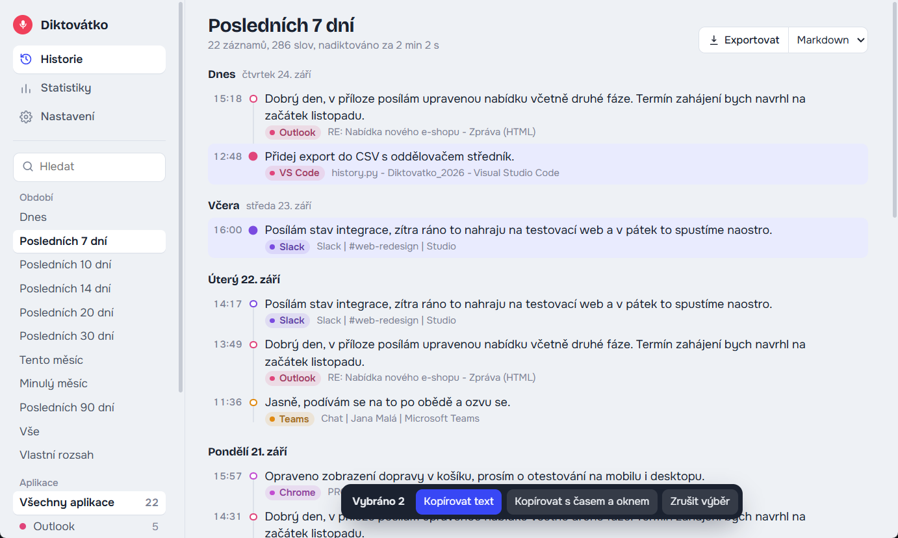

# Diktovátko

**Verze 0.7.0**, viz [přehled změn](CHANGELOG.md).

**Podržte klávesu, mluvte, pusťte. Text se vloží tam, kde máte kurzor.**

Bezplatná open-source alternativa k [Wispr Flow](https://wisprflow.ai) pro **Windows a Mac**. Funguje v jakékoli aplikaci, třeba ve Slacku, Outlooku, prohlížeči, Teams, Jiře nebo v chatu s AI. Umí česky i dalších 90+ jazyků.

**[Web projektu](https://mhudakcz.github.io/Diktovatko_2026/)** · **[Návod krok za krokem](https://mhudakcz.github.io/Diktovatko_2026/navod.html)** · **[Stáhnout ZIP](https://github.com/mhudakcz/Diktovatko_2026/archive/refs/heads/main.zip)** (Windows i Mac)

> **Ve zkratce:** zdarma a open source, pro Windows i Mac, česky a v 90+ jazycích. Podržíte zkratku (výchozí Ctrl + Win, na Macu Ctrl + ⌘), mluvíte, pustíte a text se vloží na místo kurzoru. Přepisuje offline, nebo za sekundu přes vlastní bezplatný Groq klíč. Historie a statistiky se ukládají jen do vašeho počítače. Při 2 000 slovech denně ušetří kolem 12 hodin měsíčně.

**Obsah:** [Proč diktovat](#proč-diktovat) · [Co umí](#co-umí) · [Instalace](#instalace) · [Groq klíč](#groq-klíč) · [Používání](#používání) · [Nastavení](#nastavení-configjson) · [Soukromí](#soukromí) · [Omezení](#omezení) · [Struktura](#struktura)



## Proč diktovat

Mluvíme kolem 150 slov za minutu, na klávesnici většina lidí zvládne asi 40. Když denně napíšete 2 000 slov, ušetříte diktováním přes půl hodiny denně, tedy zhruba 12 hodin měsíčně. Na [webu](https://mhudakcz.github.io/Diktovatko_2026/#uspora) si to můžete spočítat pro sebe.

## Co umí

- **Diktování kamkoliv.** Podržíte zkratku, mluvíte, pustíte a přepis se vloží do aktivního pole. Schránka se potom vrátí do původního stavu.
- **Zkratka podle vás.** Windows: výchozí Ctrl + Win, dále pravý Ctrl, Ctrl + Alt + mezerník a další. Mac: výchozí Ctrl + ⌘, dále Fn / 🌐, pravý ⌘, pravý ⌥ a další. Jde nastavit i vlastní. Když během držení stisknete jinou klávesu (Ctrl+C), nahrávání se zruší, takže běžné zkratky dál fungují.
- **Indikátor nahrávání.** Dole uprostřed obrazovky se objeví malá „pilulka“. Při nahrávání ukazuje hlasitost vašeho hlasu, při přepisu animaci. Nebere fokus, takže text jde tam, kam má.
- **Ztlumení ostatních zvuků.** Spotify, videa a další aplikace se během nahrávání ztiší a potom vrátí zpátky.
- **Historie.** Každý přepis se uloží lokálně i s časem, aplikací a názvem okna (konverzace, dokument, tiket). Jde v ní hledat, filtrovat podle období (dnes, 7/10/14/20/30/90 dní, tento či minulý měsíc, vlastní rozsah) a aplikací, kopírovat a exportovat do Markdownu nebo CSV.
- **Statistiky.** Slova, záznamy, čas mluvení a odhad ušetřeného času za dnešek, týden, měsíc i celkem. K tomu graf posledních 30 dní a přehled aplikací.
- **Nastavení v okně.** Změny platí hned po uložení, bez restartu.
- **Dva způsoby přepisu:**
  - **lokálně a offline** (Whisper large-v3-turbo na CPU), zdarma a nic neopouští počítač,
  - **přes [Groq](https://console.groq.com)** (free tier, **vlastní klíč** každého uživatele), přepis trvá kolem 1 sekundy.
- **Dlouhé diktování.** Delší nahrávky se pro Groq automaticky rozdělí v tichém místě.
- **Ochrana před „halucinacemi“.** Ticho se k přepisu vůbec neposílá a typické vymyšlené věty Whisperu (třeba „Titulky vytvořil…“) se zahodí.

## Instalace

Podrobně s obrázky a řešením problémů: **[návod krok za krokem](https://mhudakcz.github.io/Diktovatko_2026/navod.html)**.

Potřebujete [Python 3.11+](https://www.python.org/downloads/). Ve Windows při instalaci Pythonu zaškrtněte „Add python.exe to PATH“.

| | Windows 10/11 | macOS 12+ |
|---|---|---|
| 1. | Stáhněte [ZIP](https://github.com/mhudakcz/Diktovatko_2026/archive/refs/heads/main.zip) a rozbalte ho | stejně |
| 2. | Spusťte `install.bat` | `install.command` (poprvé přes pravé tlačítko → Otevřít) |
| 3. | Spusťte `start.bat`, ikona se objeví vedle hodin | `start.command`, ikona se objeví v horní liště |

**Mac:** v *Nastavení systému → Soukromí a zabezpečení* povolte Terminálu **Mikrofon**, **Zpřístupnění** a **Sledování vstupu** (volitelně **Nahrávání obrazovky** pro názvy oken v historii). Pokud si zvolíte klávesu Fn, nastavte v *Klávesnice* u klávesy 🌐 volbu **Nedělat nic**. Mac verze je nová, chyby prosím hlaste v [Issues](https://github.com/mhudakcz/Diktovatko_2026/issues).

### Groq klíč

Každý si vytváří **vlastní** bezplatný klíč. V repozitáři žádný klíč není a výchozí nastavení je prázdné.

1. Na [console.groq.com/keys](https://console.groq.com/keys) se přihlaste (Google nebo e-mail, bez karty).
2. Klikněte na **Create API Key** a klíč (`gsk_…`) zkopírujte.
3. V Diktovátku otevřete **Nastavení**, klíč vložte do pole **Groq API klíč** a klikněte na **Uložit nastavení**.

Bez klíče se přepisuje offline. Při prvním použití se stáhne model Whisper (~1,6 GB).

## Používání

| Ikona / pilulka | Stav |
|---|---|
| šedá | načítá se model |
| tmavá | připraveno |
| červená, pilulka se sloupečky | nahrává |
| modrá, pilulka s vlnou | přepisuje |

**Kliknutím na ikonu** otevřete okno s historií, statistikami a nastavením. Přes **menu ikony** se dostanete k jednotlivým sekcím, exportu, logu a ukončení.

## Nastavení (`config.json`)

Nejjednodušší je nastavovat v okně aplikace (sekce *Nastavení*). Soubor se vytvoří při prvním spuštění a jde upravit i ručně, změny se projeví do sekundy.

| Klíč | Výchozí | Popis |
|---|---|---|
| `hotkeys` | `["ctrl+windows"]` (Mac `["ctrl+cmd"]`) | zkratka, např. `"right ctrl"`, `"ctrl+alt+space"`, na Macu `"fn"`, `"right cmd"` |
| `mode` | `"hold"` | `"hold"` = drž a mluv, `"toggle"` = stisk start, další stisk stop |
| `language` | `"cs"` | kód jazyka, nebo `null` pro automatickou detekci |
| `model` | `"large-v3-turbo"` | lokální model, `small` je rychlejší, ale méně přesný |
| `initial_prompt` | … | slovník a styl: jména, odborné výrazy |
| `groq_api_key` | `""` | vlastní klíč z [console.groq.com](https://console.groq.com), jde nastavit i přes proměnnou `GROQ_API_KEY` |
| `duck_audio` / `duck_level` | `true` / `0.1` | ztlumení zvuku během nahrávání (Mac ztiší celý výstup) |
| `overlay` | `true` | plovoucí indikátor nahrávání |
| `history` | `true` | ukládání historie |
| `sounds` | `true` | pípnutí při startu a konci nahrávání |
| `trailing_space` | `true` | mezera za vloženým textem |

## Historie a export z příkazové řádky

Historie je v souboru `history.db` (SQLite) ve složce aplikace.

```
.venv\Scripts\python.exe history.py --month 2026-09
.venv\Scripts\python.exe history.py --from 2026-09-01 --to 2026-09-15 --format csv
.venv\Scripts\python.exe history.py --search "faktura"
```

Na Macu použijte `.venv/bin/python`.

## Soukromí

- Při lokálním přepisu nic neopouští počítač.
- S Groq klíčem se nahrávka posílá na servery Groq (USA). Text ani historie se nikam neposílají.
- `config.json` (s klíčem), `history.db` a log jsou v `.gitignore`, takže se nedostanou do gitu.
- Historie je uložená jako čitelný text. Když ji nechcete, vypněte ji v nastavení.

## Omezení

- Windows: do oken spuštěných jako správce se vkládá, jen pokud Diktovátko také běží jako správce.
- Mac: ztlumení ztiší celý zvuk počítače (macOS nemá hlasitost po aplikacích). Názvy oken vyžadují oprávnění Nahrávání obrazovky.
- Lokální přepis na CPU trvá zhruba 1–1,5× délku nahrávky.

## Struktura

| Soubor | Účel |
|---|---|
| `diktovatko.py` | hlavní aplikace: ikona v liště, nahrávání, přepis, vložení textu |
| `plat.py` | vybere implementaci pro aktuální systém |
| `platform_win.py`, `platform_mac.py` | vše systémové: zkratky, vkládání, aktivní okno, zvuky, ztlumení, automatické spouštění |
| `hotkeys.py` | vyhodnocení zkratek (levá a pravá klávesa, zrušení jinou klávesou), Windows obsluha |
| `overlay.py` | vykreslení indikátoru a Windows okno. Mac okno je v `platform_mac.py` |
| `audio_duck.py` | ztlumení aplikací ve Windows |
| `history.py` | databáze historie, statistiky, export |
| `app_window.py`, `ui/app.html` | okno s historií, statistikami a nastavením (pywebview) |
| `config.py` | načítání a ukládání nastavení |
| `docs/` | web projektu a návod (GitHub Pages) |

## Licence

MIT. Autor: Michal Hudák.
